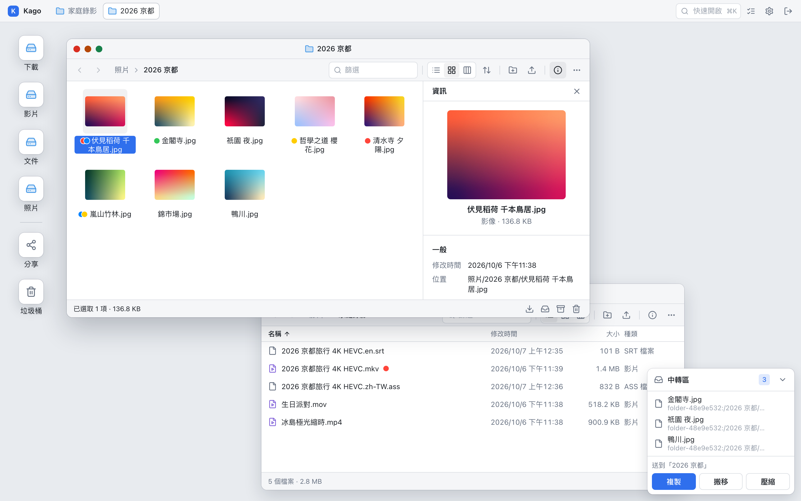
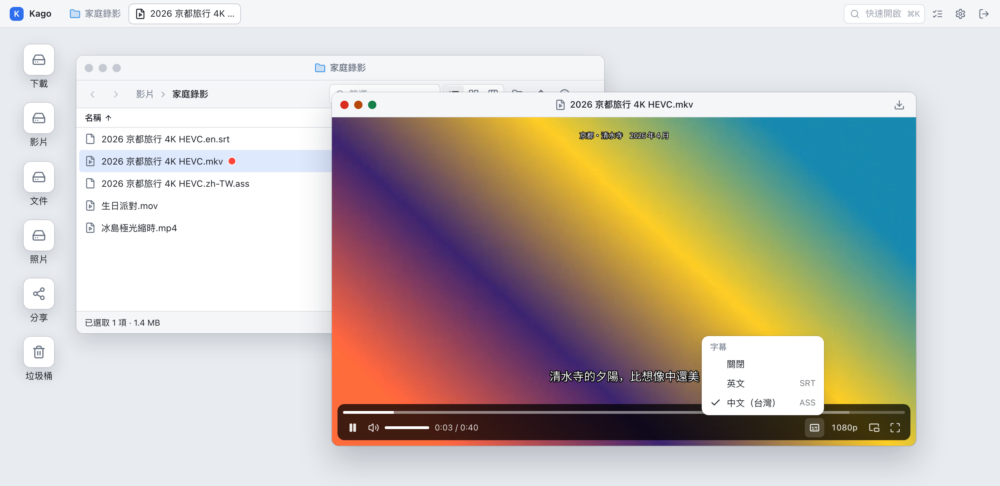
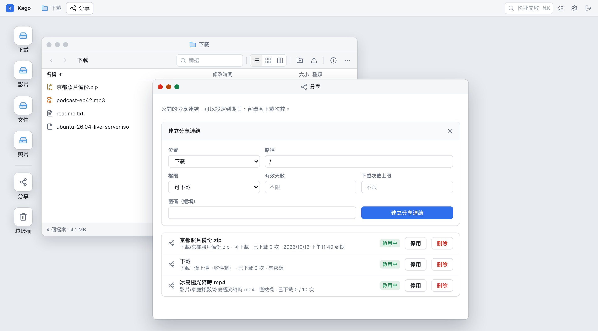
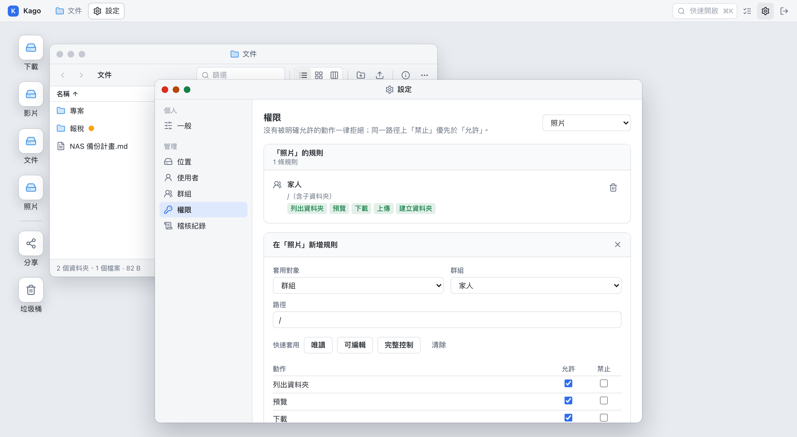
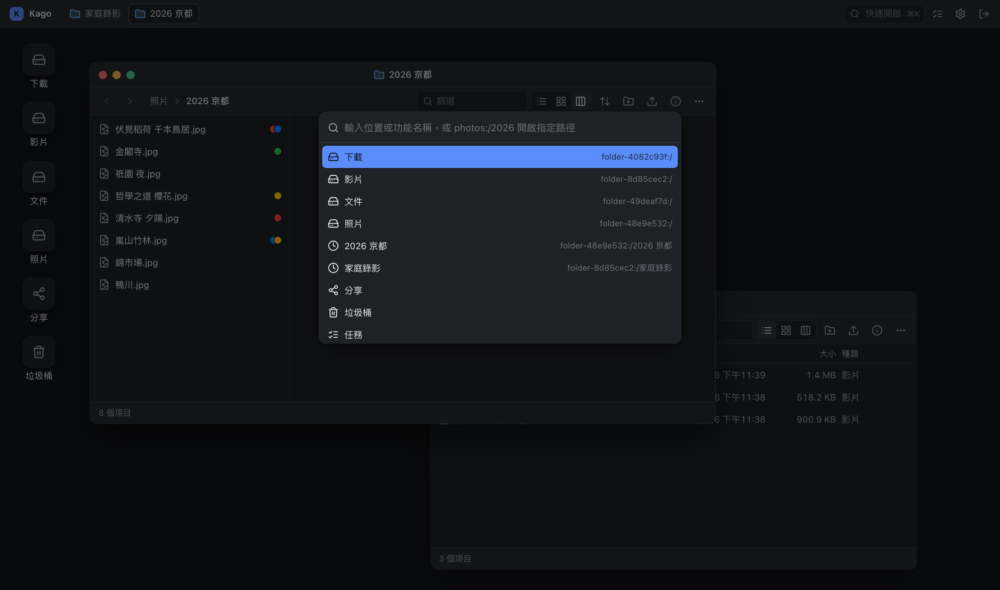

<p align="center">
  
</p>

<h1 align="center">Kago</h1>

<p align="center">
  A desktop-style file manager for your NAS.<br>
  One Docker container and two mounted folders, and you manage files in the browser the way you would in Finder.
</p>

<p align="center">
  English · <a href="README.zh.md">繁體中文</a>
</p>



## Features

- **A desktop in the browser**: open several file windows at once and drag, resize or minimize them freely. Each window holds multiple tabs and has a folder tree on the left. There are three views (list, icons and columns), and the column view opens one level per column. The next time you sign in, your windows are where you left them. Right-click any picture you like to set it as the desktop background.
- **Folders remember how they look**: the view and sort order belong to the folder, not the window, and can be applied to its subfolders. A folder you have never set up opens as icons when it holds mostly pictures and videos. These settings are stored in your account along with language, theme and motion, so they follow you to any browser.
- **Shelf**: drop files from all over the place onto the Shelf first, then copy, move or compress them to the destination in one go, without switching back and forth between folders.
- **Live video transcoding**: HEVC, AC3, mkv and rmvb that the browser can't play directly are turned into a playable stream on the fly, and you can lower the quality by hand to save bandwidth. HDR video is delivered as HDR or converted to SDR depending on your display. NVIDIA and Intel / AMD integrated GPU acceleration are supported.
- **Subtitles and audio tracks**: `.ass` / `.srt` / `.sup` / `.idx` files named after the video, subtitles embedded in an mkv (including Blu-ray and DVD image subtitles) and extra audio tracks are all listed automatically, and the subtitle in your language is loaded for you. ASS styling and positioning are rendered in full.
- **Video player**: the window follows the video's aspect ratio, and you can go full screen, picture in picture, or play in a new tab. When a folder holds several videos, you can jump straight to the previous or next one.
- **Share links**: downloadable, view-only, or a drop box that lets other people upload files to you. Every link can have an expiry date, a password and a download limit. The limit counts visitors, not requests: looking at the file and downloading it within 12 hours, from the same address and browser, count once.
- **Multiple users and permissions**: users and groups, with View and Edit permissions set down to a single folder. Everything that happens is kept in the audit log.
- **Background tasks**: copying, moving, compressing and extracting all run on the server and carry on after you close the browser. Compressing lets you pick how hard to squeeze and set a password (AES-256 or ZipCrypto); extracting a locked zip first tries the passwords saved in Settings, and only asks when none opens it.
- **Uploads of any size**: drop files or whole folders to upload them. They are streamed straight to disk, with progress, speed and time remaining.
- **Remote locations**: folders on SMB, SFTP, WebDAV and FTP can be added as locations and browsed, played and shared just like local ones. The container needs no extra privileges.
- **Sync**: sync folders between locations, by hand or on a schedule.
- **App shortcuts**: put the other services on your NAS (Jellyfin, Immich, Home Assistant…) on the desktop and open them in a new tab with one click. Type a name and icons are suggested from Dashboard Icons and selfh.st Icons, or upload your own. An administrator can put a shortcut on everyone's desktop.
- **macOS Finder tags**: the colored tags you set on your Mac can be both read and changed.
- **Trash**: deleted files go to the Trash first and can be restored.
- **Languages**: the interface comes in English, 繁體中文, 简体中文 and 日本語. It follows the browser language by default and can be switched in Settings → General.
- **Quick open**: press <kbd>⌘K</kbd> / <kbd>Ctrl K</kbd> to jump to any location or feature.
- **Dark mode**: follows the system, or switch it yourself.

| | |
| --- | --- |
|  **Live video transcoding**, with subtitles loaded automatically |  **Share links** with an expiry date, password and download limit |
|  **Folder-level permissions** for users or groups |  **Dark mode** and <kbd>⌘K</kbd> Quick open |

## Quick start

You need a NAS or Linux host with Docker (`amd64` or `arm64`).

```bash
docker run -d \
  --name kago \
  -p 8080:8080 \
  -v /volume1/files:/data \
  -v /volume1/docker/kago:/app-data \
  -e PUID=1000 \
  -e PGID=1000 \
  --restart unless-stopped \
  ghcr.io/gnehs/kago:latest
```

Replace `/volume1/files` with the folder you want to manage and `/volume1/docker/kago` with where Kago should keep its own data, then open `http://<NAS IP>:8080` and create the first administrator on the setup page.

If you prefer Docker Compose:

```yaml
services:
  kago:
    image: ghcr.io/gnehs/kago:latest
    container_name: kago
    ports:
      - "8080:8080"
    volumes:
      - /volume1/files:/data
      - /volume1/docker/kago:/app-data
    environment:
      PUID: "1000"
      PGID: "1000"
    restart: unless-stopped
```

### The two mount points

| Path in the container | Purpose |
| --- | --- |
| `/data` | The files you want to manage. **Each folder directly inside it** becomes a "location" in the file manager, so mount a directory that holds several folders, or mount several folders to sub-paths such as `/data/Photos` and `/data/Videos`. |
| `/app-data` | Kago's own data: the SQLite database (accounts, permissions, share links, audit log), the Trash, thumbnails and transcoding scratch files. **Back this folder up.** |

To bring together folders that live on different disks, mount each one separately:

```bash
-v /volume1/photo:/data/Photos \
-v /volume2/video:/data/Videos \
-v /volume1/homes/me/Documents:/data/Documents
```

A location is named after its folder. To make a location read-only, set it in Settings → Locations.

### Remote locations (SMB, SFTP, WebDAV, FTP)

Folders that aren't on this machine can be locations too. In Settings → Locations → Add remote location, pick the kind, fill in the connection details, press "Test connection" to check them, and save. The location then appears in the file manager next to the folders under `/data`. Browsing, previews, video playback and transcoding, thumbnails, uploads, renaming, moving and copying (across locations too), compressing and extracting, share links and permissions all work as usual.

- The connection is made entirely in user space (by the [rclone](https://rclone.org) bundled in the image). **The container needs no extra privileges**, and nothing has to be mounted on the host first.
- Passwords and keys are encrypted before they go into the database. The key is `/app-data/storage.key`; keep it when you back up `/app-data`, because saved passwords can't be decrypted without it.
- "Share and folder" can be left empty for SMB: the whole server is then one location, and its first level lists every share. The shares themselves are managed by the server, so they can't be created, renamed, moved or deleted in Kago; once inside a share, everything works like any other location. If you only want one share or a subfolder, enter `share` or `share/folder`.
- A location's name and connection details can be changed later under Settings → Locations → Connection, and take effect as soon as you save. The location's URL (its slug), its permissions and its share links are not affected by renaming.
- Items deleted in a remote location are moved to a `.kago-trash` folder at the root of that remote (one per share when the location is a whole server), and can still be restored or emptied from the Trash. Kago never lists this folder.
- Features that need the whole file (thumbnails of PDFs and documents, camera RAW, shooting info, SQLite previews, extraction) first fetch it to `/app-data/temp/remote`, up to 4 GB per file, and clear it after 12 hours without use. Videos are read as they play and are never downloaded in full.
- Finder tags live in a file's extended attributes, which remote locations don't have. A same-named `.idx` + `.sub` subtitle pair isn't listed in remote locations either. Kago's own tags are not affected.
- SFTP can use a password, or tick "Sign in with Kago's SSH key" and add the public key shown in the form to the other side's `~/.ssh/authorized_keys`. The key is Kago's own (`/app-data/ssh/id_ed25519`, generated the first time it is needed).

### Sync

Settings → Sync stores sync jobs: bring the contents of one folder to another, by hand, or automatically at an interval, every day or every week. Each run is a task, so its progress, cancellation and result are in the task list, and it is recorded in the audit log.

- The two sides can be any two locations, local or remote. To sync with another machine, add it as a remote location first.
- "Copy new and changed files" never deletes anything at the destination. "Make the destination identical" deletes what the source no longer has, and needs permission to delete at the destination. When in doubt, tick "Trial run" first; it only reports what would change.
- Creating and running a sync needs permission to sync the folders at both ends. A scheduled sync runs as the person who created it; when that person is disabled or loses permission, the run is skipped and noted in the audit log.
- Schedules follow the server's time zone, which you can set with the `TZ` environment variable (for example `TZ=Asia/Taipei`).

### Single sign-on (OIDC)

Kago can sign people in through a standard OpenID Connect identity provider: Pocket ID, Authentik, Keycloak and the like, with whatever the provider offers for signing in (passkeys, for example). Kago is only ever the client and issues no identities of its own; the provider decides who someone is, and what they may do stays with Kago's users, groups and permissions.

Under Settings → Single sign-on, fill in the issuer URL, the client ID and the client secret (leave it empty for a public client, which PKCE protects), then register the redirect URI the page shows (`https://your-address/api/auth/oidc/callback`) with the provider.

- **Existing accounts are matched by email**: the first time an identity signs in, if there is a Kago account with the same email address and the provider reports the address as verified (`email_verified: true`), the identity is linked to that account and signed in to it. Once linked, Kago knows it by `issuer + subject` only; changing the email at the provider later makes no difference.
- **When the provider does not report it as verified**: nothing is merged, and the sign-in page says why. This keeps someone from taking over another person's account by changing their email at the provider to match. Turn on email verification at the provider (or have it send `email_verified`), or sign in with your password and link by hand under Settings → General → Account.
- **Creating accounts automatically**: off by default. When on, someone the provider lets through who has no account yet gets a new one the first time they sign in, as a standard user or a guest, never an administrator.
- **Group sync**: off by default. When on, the provider's groups put people into Kago's groups by the mapping you set; only mapped groups are touched, and members added by hand stay. A provider's group never makes anyone an administrator. Add whatever scope the provider needs for groups (usually `groups`).
- **Automatic redirect**: sends anyone not signed in straight to the provider. The password form always stays at `/login?local=1`.
- **Checking back with the provider**: with `offline_access` among the scopes and a provider that issues refresh tokens, Kago asks the provider about every hour; when it no longer stands behind the sign-in, the Kago session ends too.

When the provider is down, accounts with a password can still sign in at `/login?local=1`. If no administrator can get in at all (no password, or the settings are wrong), run this on the host:

```bash
docker exec -it kago kago-entrypoint node dist/recover.js you@example.com
```

It gives that account a new password and makes it an enabled administrator (creating it if there is none); add `--disable-sso` to turn single sign-on off as well.

### App shortcuts

Settings → Apps puts the address of another service on the desktop; you can also right-click a shortcut on the desktop to add, edit or remove one. Everyone manages their own shortcuts, and nobody else sees them. When an administrator ticks "Show on everyone's desktop", the shortcut appears on every desktop and only administrators can change it.

- A shortcut opens in a new tab by default. Only `http://` and `https://` addresses are accepted.
- "Opens in" can be set to "A window in Kago", which shows the service inside a window on the desktop. This may not work: many services are set up to refuse being shown inside another page (`X-Frame-Options`, CSP `frame-ancestors`), and some can't keep you signed in there, in which case the window stays blank. When Kago is served over HTTPS and the service is not, the browser always refuses. The window's title bar can open the service in a new tab at any time.
- As you type a name, Kago looks for an icon by that name in [Dashboard Icons](https://github.com/homarr-labs/dashboard-icons) and [selfh.st Icons](https://selfh.st/icons/). The server does the looking and the downloading, from `cdn.jsdelivr.net`; your browser never contacts a third party. The icon you pick is copied to `/app-data/app-icons` and needs no network after that.
- When the server can't reach the internet there are no suggestions, and you can still upload a PNG, JPEG, WebP or SVG of up to 1 MB, or keep the default icon.
- Kago never contacts the address you enter (to fetch its favicon, say): icons come only from the two libraries above, or from the file you upload.

### File ownership (PUID / PGID)

Kago follows the linuxserver.io convention: the container starts as root, fixes the ownership of `/app-data`, then drops to `PUID:PGID`. Files Kago writes belong to that user, so enter the account that owns those files on your NAS. SSH into the NAS and run `id <account>` to look it up.

| Variable | Default | Description |
| --- | --- | --- |
| `PUID` | `1000` | The UID Kago runs as |
| `PGID` | `1000` | The GID Kago runs as |
| `UMASK` | `022` | The umask for new files and folders; `022` gives `644` / `755`, `000` gives `666` / `777` |

- `/data` is never chowned, so make sure the directory itself is readable and writable by `PUID:PGID`.
- Unraid usually uses `PUID=99`, `PGID=100` and `UMASK=000`.
- If you set the identity with `docker run --user` instead, `PUID` / `PGID` are ignored and only `UMASK` applies.

### Other environment variables

| Variable | Default | Description |
| --- | --- | --- |
| `PORT` | `8080` | The port listened on inside the container |
| `ADMIN_EMAIL` / `ADMIN_PASSWORD` | none | Creates the administrator on first start and skips the setup page. Both must be given together |
| `SESSION_SECRET` | generated | The secret that signs sign-in sessions. When not given, one is generated and kept in `/app-data/session.secret` for reuse |
| `TRUST_PROXY` | trust nothing | Set it when Kago is behind a reverse proxy; see [Access from outside](#access-from-outside). The number of proxies (`1`), the proxy's address or subnet, or `true` (trust everything; only when Kago can't be reached directly) |

## Video transcoding and hardware acceleration

The image ships with `jellyfin-ffmpeg`, so there is nothing else to install. Videos the browser can decode itself are played from the original file. For the ones it can't, containers such as mkv, or when you pick a lower quality in the player's controls, the server transcodes to an H.264 + AAC HLS stream on the fly. Seeking starts transcoding from that point in time, with no waiting from the beginning.

**HDR video.** When an HDR10 or HLG video is played, the player checks the current display and browser. If the display can show HDR and the browser can decode it, the server sends a 10-bit HEVC HDR stream; otherwise it tone-maps the picture to SDR so the colors don't turn gray and washed out. Drag the window to another display, or switch the display's HDR mode, and the stream changes with it. The bottom of the quality menu says which one is in use. Browsers treat 203 nits as the white of a web page, a step darker than players such as QuickTime that work from 100 nits, so a darkly graded film can look as if it had no HDR at all. For that reason, transcoded HDR10 output brightens shadows and midtones by about two times by default (highlights keep the master's peak); untick "Brighten HDR" in the same menu to see the original grade. HDR played from the original file doesn't go through the server and isn't brightened. You can also untick "HDR output" and watch the SDR version the server produces. An HDR file the browser can play directly is still played from the original file on an HDR display; on a display without HDR, the server converts it to SDR instead of relying on each browser's own conversion. You can still pick "Original file" in the quality menu by hand and leave it to the browser. HDR output needs an encoder that supports 10-bit HEVC (most recent GPUs, or libx265 on the CPU); the `video transcoding uses ...` line in the startup log reports what was detected. Videos that carry only Dolby Vision without an HDR10-compatible layer (Profile 5) can't have their colors reproduced correctly.

It works without a GPU too, just with software encoding on the CPU. To let the container use a GPU, hand it the device:

```bash
# Intel / AMD integrated graphics (Quick Sync on Synology, QNAP, Unraid and so on)
docker run --device /dev/dri:/dev/dri ... ghcr.io/gnehs/kago:latest
```

```bash
# NVIDIA: the host needs the NVIDIA Container Toolkit installed first
docker run --gpus all ... ghcr.io/gnehs/kago:latest
```

With Compose, add `devices: ["/dev/dri:/dev/dri"]` under the service.

At startup Kago actually encodes a short clip to choose an encoder, in the order NVIDIA NVENC → Intel / AMD VAAPI → software (libx264). The result is written to the startup log (`video transcoding uses ...`) and shown at the bottom of the quality menu. When the GPU can't handle a particular file, that playback falls back to software encoding automatically.

| Variable | Default | Description |
| --- | --- | --- |
| `TRANSCODE_HWACCEL` | `auto` | `auto`, `nvenc`, `vaapi` or `none` (software only). Falls back to software when the chosen encoder isn't available |
| `TRANSCODE_VAAPI_DEVICE` | automatic | The render node VAAPI uses, for example `/dev/dri/renderD129`; when unset, each `/dev/dri/renderD*` is tried in turn |
| `FFMPEG_PATH` / `FFPROBE_PATH` | bundled | Use a different ffmpeg binary |

The integrated GPU's render node belongs to the host's `render` / `video` groups, and the entrypoint adds `PUID` to them automatically; if you start the container with `--user`, add `--group-add` yourself. Transcoding scratch files live in `/app-data/temp/transcode` and are removed when the window is closed or after a period of inactivity.

## Subtitles and audio tracks

When you play a video, Kago finds its subtitles on its own, lists them in the "Subtitles and audio" menu in the player's controls, and picks one to show. No setup is needed.

**Subtitle files next to the video.** Text subtitles `.ass`, `.ssa` and `.srt` are supported, as are the image subtitles `.sup` (Blu-ray PGS) and `.idx` + `.sub` (DVD VobSub; the two files must sit together under the same name, and an `.idx` with several languages is listed once per language). The file name must start with the video's name and may then add a language and flags, separated by `.`:

| File name | Meaning |
| --- | --- |
| `Movie.mkv` | The video |
| `Movie.ass` | A subtitle with no language given |
| `Movie.zh-TW.ass` | Traditional Chinese. `zh-Hant`, `cht` and `tc` work too |
| `Movie.zh-CN.srt` | Simplified Chinese. `zh-Hans`, `chs` and `sc` work too |
| `Movie.en.srt` | English. Languages can be ISO codes such as `en` or `eng` |
| `Movie.en.sdh.srt` | Subtitles for the deaf and hard of hearing (`sdh` or `cc`) |
| `Movie.ja.forced.ass` | Forced subtitles, which translate only foreign dialogue and on-screen text (`forced`) |
| `Movie.zh-TW.default.ass` | The default subtitle, chosen ahead of the others (`default`) |
| `Movie.Director's commentary.en.srt` | Any other text becomes the subtitle's name |

**Subtitles embedded in the video.** Text subtitles inside containers such as mkv and mp4 (ASS, SRT and so on) are listed as well, and use the fonts attached to the video. Image subtitles from Blu-ray, DVD and digital TV (PGS, VobSub, DVB) are listed too. Whether embedded or next to the video, browsers can't draw this kind of subtitle, so choosing one switches to transcoded playback and the server burns the subtitle into the picture. Reading the embedded subtitles of a large file for the first time means scanning the whole file, which can take a few seconds.

**Which one is shown by default.** In order: the language you last chose by hand (or "Off"), a subtitle file flagged `default`, a subtitle matching the browser language, the embedded subtitle the video itself marks as default, then the first one in the list.

**Fonts and encodings.** Subtitles are drawn by libass, so ASS styles, positioning and effects are kept; SRT gets one consistent default style. Subtitle files rarely come with fonts, so Kago loads Noto Sans for Traditional Chinese, Simplified Chinese, Japanese or Korean as needed, based on the subtitle's content and your language, to fill in missing glyphs. Older subtitles that aren't UTF-8 are read as Big5, GBK, Shift_JIS or EUC-KR according to their language.

**Audio tracks.** When a video has several audio tracks, the same menu switches between them. Browsers only play a file's first audio track, so choosing another one switches to transcoded playback.

**Picture in picture.** Press the picture-in-picture button in the player's controls and the subtitles come along. In Chrome or Edge over HTTPS (or on `localhost`), the whole player floats, controls included; elsewhere the subtitles are drawn straight into the floating picture. Picture in picture started from the browser's own menu or button shows only the video, without subtitles.

## Access from outside

Kago itself only serves HTTP. To reach it from outside, put it behind a reverse proxy (Synology's built-in reverse proxy, Nginx Proxy Manager, Caddy, Traefik and so on) with HTTPS turned on. Mind three things when you set it up:

- **Enable WebSocket**: task progress and live updates go through `/ws`.
- **Raise the upload size limit**: Kago doesn't limit upload size, but most reverse proxies have a default cap (Nginx's `client_max_body_size`, for example).
- **Set `TRUST_PROXY`**: without it, everyone Kago sees comes from the reverse proxy's address. The IPs in the audit log are wrong, the limit on wrong password guesses is shared by everybody, and the sign-in cookie isn't marked HTTPS-only. With a single reverse proxy in front, set it to `1` (the number of proxies), or to the address or subnet the proxy connects from (for example `172.16.0.0/12`). **Don't set it when there is no reverse proxy**, or anyone can claim to be some other address.

## Updating

```bash
docker pull ghcr.io/gnehs/kago:latest
docker stop kago && docker rm kago
# then run docker run again with the same arguments
```

With Compose it is `docker compose pull && docker compose up -d`. All state lives in `/app-data`, so recreating the container loses nothing.

Every push to `main` publishes `latest` and `sha-<commit>`; pushing a `v*` tag also publishes the matching version number. Use those tags if you want to pin a version.

## FAQ

**There is no Files icon on the desktop.**
The icon and its locations only appear when `/data` contains folders; files placed directly in the root of `/data` aren't shown.

**Uploading or creating a folder fails with a permission error.**
"Kago's system account has no permission for this on the server's disk" means the account behind `PUID` / `PGID` can't read or write the folder mounted into `/data`. That has nothing to do with the permissions set inside Kago, and can't be changed from there. Settings → Locations marks the locations whose top folder can't be read or written, and shows the UID and GID Kago really runs as; the path that was refused is in the container's log (`docker logs kago`). Change the variables, or change the folder's permissions on the NAS. A location that is only meant to be read can simply be made read-only.

**Finder tags aren't shown.**
Tags live in a file's extended attributes (xattr). The underlying filesystem has to support them, and the file has to have been saved from a Mac in a way that keeps xattrs (SMB, for example).

**A remote location won't connect.**
In Settings → Locations, press that location's "Connection" and then "Test connection" to see the reason the other side reports (wrong user name or password, share not found, host unreachable and so on). The container has to be able to reach that machine: on a bridge network, enter an IP or a host name the container can resolve; `.local` names usually don't resolve.

**A subtitle doesn't appear in the menu.**
Check that the subtitle file is in the same folder as the video, that its name starts with exactly the video's name (the part before the extension), and that you have permission to read the subtitle file. See [Subtitles and audio tracks](#subtitles-and-audio-tracks).

**A video has no quality menu or won't play.**
Look for `video transcoding uses ...` in the startup log to confirm that ffmpeg is working and which encoder is actually in use.

## Development

A `pnpm` workspace: the front end is React + Vite (`apps/web`), the back end is Node.js + Fastify with the built-in `node:sqlite` (`apps/server`).

```bash
corepack enable
pnpm install
pnpm dev
```

The back end is at `http://localhost:8080`; the Vite front end is at `http://localhost:5173` and proxies the API to the back end. Local transcoding uses the `ffmpeg` / `ffprobe` on your `PATH`; without them, videos are still played from the original file. HEIF photos are decoded by ffmpeg as well. Camera RAW previews and photo shooting info are read by the exiftool installed with the packages, which needs `perl` on the system (built into macOS, and installed in the image).

Before sending a change:

```bash
pnpm typecheck
pnpm lint
pnpm build
pnpm test:smoke
```

To build the image yourself:

```bash
docker build -t kago:local .
```

### Translations

Interface text is always written in English in the code and wrapped in `t()` (`apps/web/src/lib/i18n.ts`). The dictionary for each language is in `apps/web/src/locales/`, keyed by the English source text:

```tsx
t("Download")
t("{count} file | {count} files", { count })   // singular | plural, decided by count
t("Location##GPS")                             // what follows ## is context for translators and is never shown
```

- **Adding text**: write `t("…")` in English, then add the translation to each dictionary. Languages that don't have it yet show the English.
- **Server error messages**: the back end always replies in English (`new AppError(404, "Path not found", …)`) and the front end translates it with the same dictionaries, so a new error message needs a dictionary entry too.
- **Adding a language**: add a dictionary to `locales/`, and register it in `Locale` in `lib/prefs.ts` and in `localeNames` and `dictionaries` in `lib/i18n.ts`.
- `pnpm i18n` lists the translations each language is missing, has left over, or whose `{parameters}` don't match.

## License

Copyright (C) 2026 gnehs

Kago is released under the [GNU Affero General Public License v3.0](LICENSE) (`AGPL-3.0-only`). You are free to use, modify and distribute it. If you distribute a modified version, or offer a modified version to others as a network service, you must provide the corresponding source code under the same license.

The Docker image also contains [jellyfin-ffmpeg](https://github.com/jellyfin/jellyfin-ffmpeg), a separate program licensed under GPL-3.0; see that project for its source code.

The third-party packages Kago uses and their license terms are listed in [THIRD-PARTY-NOTICES](THIRD-PARTY-NOTICES), and a copy is included in the image (`/app/THIRD-PARTY-NOTICES`). When dependencies change, run `pnpm notices` to regenerate it.
