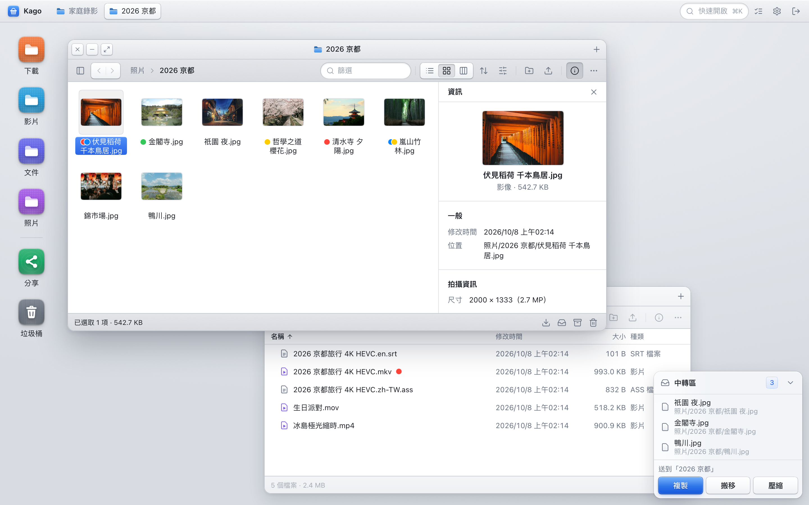
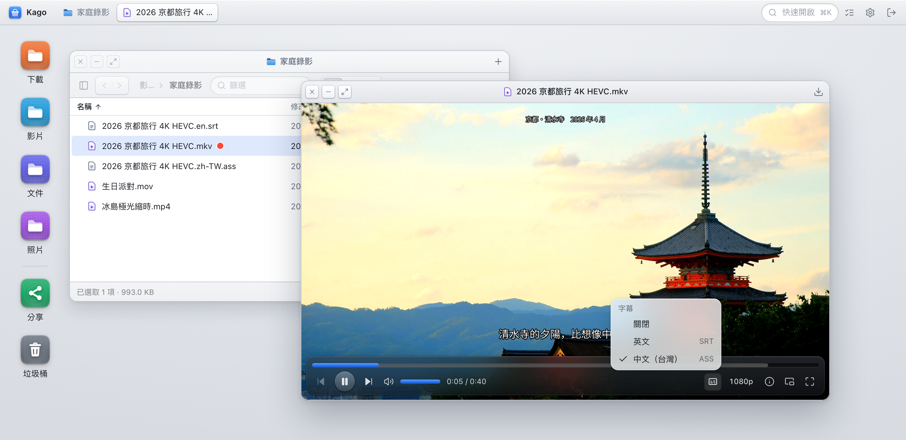
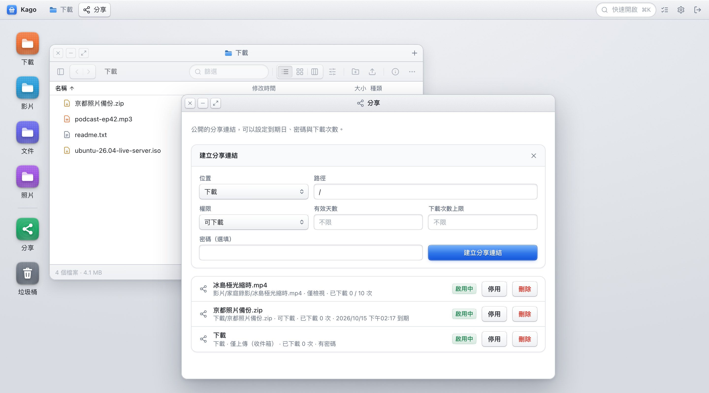
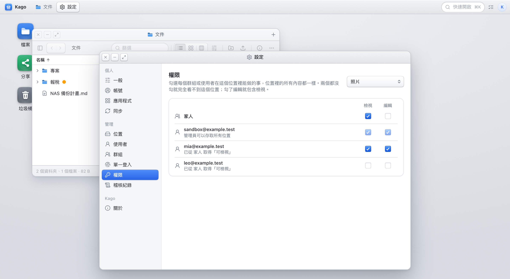
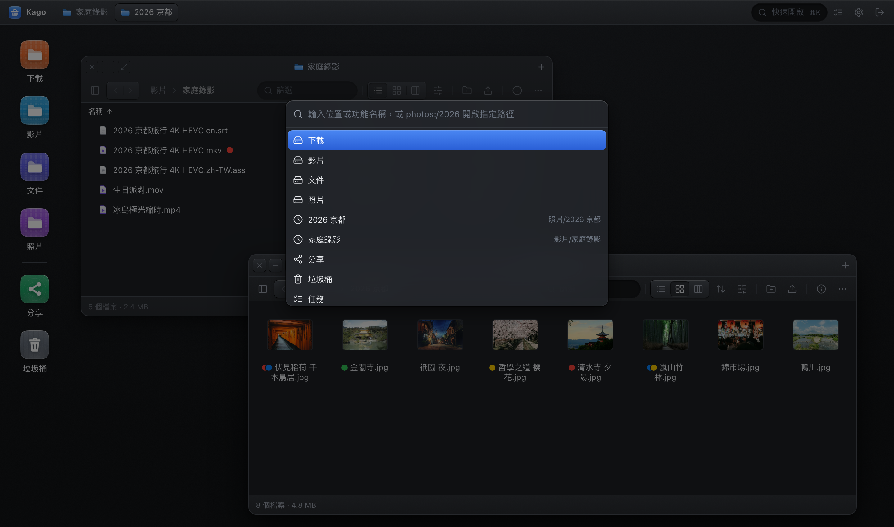

<p align="center">
  
</p>

<h1 align="center">Kago</h1>

<p align="center">
  裝在 NAS 上的桌面式檔案管理器。<br>
  一個 Docker container、掛兩個資料夾，就能在瀏覽器裡像用 Finder 一樣管理檔案。
</p>

<p align="center">
  <a href="README.md">English</a> · 繁體中文
</p>



## 功能

- **瀏覽器裡的桌面**：同時開多個檔案視窗，自由拖曳、縮放、最小化；每個視窗可以開多個分頁，左側有資料夾樹；列表、圖示、直欄三種檢視，直欄一欄一層往下展開。下次登入時，視窗會回到你離開時的位置。挑一張喜歡的圖片，右鍵就能設為桌面背景。
- **資料夾記得自己的樣子**：檢視方式與排序跟著資料夾，而不是跟著視窗；可以套用到子資料夾，沒設定過的資料夾若大多是圖片與影片會自動以圖示開啟。這些設定連同語言、主題、動畫都存在帳號裡，換瀏覽器也一樣。
- **中轉區**：先把四散各處的檔案丟進中轉區，再一次複製、搬移或壓縮到目的地，不必來回切換資料夾。
- **影片即時轉檔**：瀏覽器不能直接播的 HEVC、AC3、mkv、rmvb 會自動轉成可播放的串流，也能手動降畫質省流量。HDR 影片會依螢幕自動以 HDR 輸出或轉成 SDR。支援 NVIDIA 與 Intel / AMD 內顯硬體加速。
- **字幕與音軌**：影片旁同名的 `.ass` / `.srt` / `.sup` / `.idx`，以及 mkv 內嵌的字幕（包含藍光與 DVD 的圖形字幕）與其他音軌都會自動列出，字幕依你的語言自動載入。ASS 的樣式與定位完整呈現。
- **影片播放器**：視窗跟著影片比例縮放，可以全螢幕、子母畫面，或在新分頁中播放；同一個資料夾有多部影片時，可以直接切到上一部、下一部。
- **分享連結**：可下載、僅檢視，或是讓別人上傳檔案給你的收件箱；每條連結都能設定到期日、密碼與下載次數上限。上限算的是訪客而不是請求：同一個位址與瀏覽器在 12 小時內檢視與下載同一個檔案，只算一次。
- **多人與權限**：使用者、群組，加上精細到單一資料夾的檢視 / 編輯權限。所有操作都留有稽核紀錄。
- **背景任務**：複製、搬移、壓縮、解壓縮都在伺服器上執行，關掉瀏覽器也會繼續跑。壓縮時可以選壓縮密度，也能設密碼（AES-256 或 ZipCrypto）；解壓縮加密的 zip 時會先試你在設定裡存的密碼，都打不開才問你。
- **不限大小的上傳**：拖放檔案或整個資料夾即可上傳，直接串流寫入磁碟，並顯示進度、速度與剩餘時間。
- **遠端位置**：SMB、SFTP、WebDAV、FTP 上的資料夾可以直接加成位置，和本機資料夾一樣瀏覽、播放、分享，容器不需要額外權限。
- **同步**：在位置之間同步資料夾，可手動執行或設定排程。
- **應用程式捷徑**：把 NAS 上的其他服務（Jellyfin、Immich、Home Assistant…）放到桌面上，點一下就在新分頁開啟。輸入名稱就會從 Dashboard Icons 與 selfh.st Icons 推薦圖示，也可以自己上傳；管理員可以把捷徑放到所有人的桌面上。
- **macOS Finder 標籤**：讀得到也改得了你在 Mac 上設定的彩色標籤。
- **垃圾桶**：刪除的檔案先進垃圾桶，可以還原。
- **多國語言**：介面有 English、繁體中文、简体中文、日本語，預設跟隨瀏覽器語言，也可以在「設定 → 一般」切換。
- **快速開啟**：按 <kbd>⌘K</kbd> / <kbd>Ctrl K</kbd> 跳到任何位置或功能。
- **深色模式**：跟隨系統，或自行切換。

| | |
| --- | --- |
|  **影片即時轉檔**，自動載入字幕 |  **分享連結**，可設到期日、密碼與次數 |
|  **資料夾層級的權限**，依使用者或群組設定 |  **深色模式**與 <kbd>⌘K</kbd> 快速開啟 |

## 快速開始

需要一台裝有 Docker 的 NAS 或 Linux 主機（`amd64` 或 `arm64`）。

```bash
docker run -d \
  --name kago \
  -p 8080:8080 \
  -v /volume1/files:/data \
  -v /volume1/docker/kago:/app-data \
  -e PUID=1000 \
  -e PGID=1000 \
  --restart unless-stopped \
  ghcr.io/gnehs/kago:latest
```

把 `/volume1/files` 換成你想管理的資料夾，`/volume1/docker/kago` 換成要存放 Kago 自身資料的位置，然後打開 `http://<NAS 的 IP>:8080`，在初始化頁面建立第一位管理員。

偏好 Docker Compose 的話：

```yaml
services:
  kago:
    image: ghcr.io/gnehs/kago:latest
    container_name: kago
    ports:
      - "8080:8080"
    volumes:
      - /volume1/files:/data
      - /volume1/docker/kago:/app-data
    environment:
      PUID: "1000"
      PGID: "1000"
    restart: unless-stopped
```

### 兩個掛載點

| 容器內路徑 | 用途 |
| --- | --- |
| `/data` | 你要管理的檔案。**底下的每個資料夾**會各自成為檔案管理裡的一個「位置」，所以請掛載一個裝著多個資料夾的目錄，或是把多個資料夾分別掛到 `/data/照片`、`/data/影片` 這樣的子路徑。 |
| `/app-data` | Kago 自己的資料：SQLite 資料庫（帳號、權限、分享連結、稽核紀錄）、垃圾桶、縮圖與轉檔暫存。**請備份這個資料夾。** |

想把分散在不同磁碟的資料夾放在一起，分別掛載即可：

```bash
-v /volume1/photo:/data/照片 \
-v /volume2/video:/data/影片 \
-v /volume1/homes/me/Documents:/data/文件
```

位置的名稱就是資料夾名稱；想讓某個位置只能讀取，可以在「設定 → 位置」設為唯讀。

### 遠端位置（SMB、SFTP、WebDAV、FTP）

不在這台機器上的資料夾也能成為位置：在「設定 → 位置 → 新增遠端位置」選擇種類、填入連線資訊，按「測試連線」確認後儲存，它就會和 `/data` 底下的資料夾一樣出現在檔案視窗的側欄裡。瀏覽、預覽、影片播放與轉檔、縮圖、上傳、改名、搬移與複製（包含跨位置）、壓縮與解壓縮、分享連結與權限規則都照常運作。

- 連線全程在使用者空間進行（由映像檔內建的 [rclone](https://rclone.org) 負責），**容器不需要額外的權限**，也不需要在主機上先掛載。
- 密碼與金鑰會加密後存進資料庫，金鑰是 `/app-data/storage.key`；備份 `/app-data` 時請一併保留，少了它已存的密碼就解不開。
- SMB 的「分享與資料夾」可以留空：整台伺服器就是一個位置，打開後第一層是它的所有分享。分享本身由伺服器管理，在 Kago 裡不能新增、改名、搬移或刪除，進到分享裡面之後就和一般位置一樣。只想要其中一個分享或某個子資料夾時，填 `分享` 或 `分享/資料夾`。
- 位置的名稱與連線資訊之後都能在「設定 → 位置」按「連線」修改，儲存後立刻生效；位置的網址（slug）與已設定的權限、分享連結不受改名影響。
- 在遠端位置刪除的項目會搬進該遠端根目錄的 `.kago-trash` 資料夾（整台伺服器的位置則是每個分享各有一個），仍然可以從垃圾桶還原或清空；Kago 不會列出這個資料夾。
- 需要整個檔案才能讀取的功能（PDF 與文件的縮圖、相機 RAW、拍攝資訊、SQLite 預覽、解壓縮）會先把檔案抓到 `/app-data/temp/remote`，單一檔案上限 4 GB，12 小時沒用到就清掉。影片則是邊讀邊播，不會整部下載。
- Finder 標籤存在檔案的延伸屬性裡，遠端位置沒有；同名的 `.idx`＋`.sub` 字幕在遠端位置也不會列出。Kago 自己的標籤不受影響。
- SFTP 可以用密碼，或勾選「使用 Kago 的 SSH 金鑰登入」，再把表單顯示的公鑰加到對方的 `~/.ssh/authorized_keys`。這把金鑰是 Kago 自己的（`/app-data/ssh/id_ed25519`，第一次用到時產生）。

### 同步

「設定 → 同步」可以儲存同步工作：把一個資料夾的內容帶到另一個資料夾，手動執行，或是每隔一段時間、每天、每週自動執行。每一次執行都是一個任務，進度、取消與結果都在任務清單裡，也會留下稽核紀錄。

- 兩邊可以是任意兩個位置，本機或遠端皆可。要與另一台機器同步，請先把它加成遠端位置。
- 「複製新增與變更過的檔案」不會刪除目的地的任何東西；「讓目的地完全一致」會刪除來源已經沒有的項目，需要對目的地有刪除權限。不確定時先勾「試跑」，它只回報會變更什麼。
- 建立與執行同步需要兩端資料夾的「執行同步」權限；排程的同步以建立者的身分執行，建立者被停用或失去權限時會略過並記在稽核紀錄裡。
- 排程的時間以伺服器的時區為準，可以用 `TZ` 環境變數設定（例如 `TZ=Asia/Taipei`）。

### 單一登入（OIDC）

Kago 可以透過標準的 OpenID Connect 身分提供者登入：Pocket ID、Authentik、Keycloak 等，提供者支援的登入方式（例如 Passkey）都能用。Kago 只當 client，自己不發身分；提供者只決定「這個人是誰」，能做什麼仍由 Kago 的使用者、群組與權限決定。

在「設定 → 單一登入」填入 Issuer URL、Client ID 與 Client Secret（public client 留空，由 PKCE 保護），再把頁面上顯示的 Redirect URI（`https://你的網址/api/auth/oidc/callback`）登記到提供者那邊。

- **綁定既有帳號**：先用密碼登入，到「設定 → 一般 → 帳號」綁定。Kago 以 `issuer + subject` 認人，不會因為 Email 相同就把外部身分併進既有帳號。
- **自動建立帳號**：預設關閉。開啟後，提供者放行的人第一次登入會得到新帳號，角色是一般使用者或訪客，不會是管理員。
- **群組同步**：預設關閉。開啟後依你設定的對應，把提供者的群組對到 Kago 的群組；只動有對應的群組，手動加入的成員不受影響。提供者的群組不會讓任何人成為管理員。Scope 要加上提供者要求的項目（通常是 `groups`）。
- **自動導向**：未登入時直接前往提供者。密碼登入表單永遠保留在 `/login?local=1`。
- **向提供者再確認**：Scope 加上 `offline_access`、提供者有發 refresh token 時，Kago 大約每小時向提供者確認一次；提供者不再承認這次登入，Kago 的 session 也跟著結束。

提供者故障時，有密碼的帳號仍可從 `/login?local=1` 登入。如果管理員完全進不來（沒有密碼，或設定填錯），在主機上執行：

```bash
docker exec -it kago kago-entrypoint node dist/recover.js you@example.com
```

它會替這個帳號產生一組新密碼並設為啟用中的管理員（帳號不存在就建立）；加上 `--disable-sso` 會一併關閉單一登入。

### 應用程式捷徑

「設定 → 應用程式」可以把其他服務的網址加到桌面上，也可以在桌面的捷徑上按右鍵新增、編輯或移除。每個人管理自己的捷徑，別人看不到；管理員新增時勾選「顯示在所有人的桌面上」，它就會出現在每個人的桌面，而且只有管理員能修改。

- 捷徑一律在新分頁開啟，不會嵌在 Kago 裡，所以不受對方禁止內嵌的影響。網址只接受 `http://` 與 `https://`。
- 輸入名稱時，Kago 會從 [Dashboard Icons](https://github.com/homarr-labs/dashboard-icons) 與 [selfh.st Icons](https://selfh.st/icons/) 找出同名的圖示。查詢與下載都是伺服器向 `cdn.jsdelivr.net` 進行的，你的瀏覽器不會連到第三方；選定的圖示會存一份在 `/app-data/app-icons`，之後不再需要網路。
- 伺服器連不上外網時不會有推薦，仍然可以自己上傳 PNG、JPEG、WebP 或 SVG（1 MB 以內），或直接使用預設圖示。
- Kago 不會去連你填的網址（例如抓它的 favicon）：圖示只來自上面兩個圖示庫，或你上傳的檔案。

### 檔案權限（PUID / PGID）

Kago 沿用 linuxserver.io 的慣例：容器以 root 啟動，調整好 `/app-data` 的擁有者後，降權成 `PUID:PGID` 執行。Kago 寫入的檔案會屬於這個使用者，所以請填入在 NAS 上擁有那些檔案的帳號。用 SSH 登入 NAS 後執行 `id <帳號>` 就能查到。

| 變數 | 預設 | 說明 |
| --- | --- | --- |
| `PUID` | `1000` | 執行 Kago 的 UID |
| `PGID` | `1000` | 執行 Kago 的 GID |
| `UMASK` | `022` | 新檔案與資料夾的 umask；`022` 產生 `644` / `755`，`000` 產生 `666` / `777` |

- `/data` 不會被 chown，請確認該目錄本身可由 `PUID:PGID` 讀寫。
- Unraid 通常使用 `PUID=99`、`PGID=100`、`UMASK=000`。
- 若改用 `docker run --user` 指定身分，`PUID` / `PGID` 會被忽略，只有 `UMASK` 生效。

### 其他環境變數

| 變數 | 預設 | 說明 |
| --- | --- | --- |
| `PORT` | `8080` | 容器內監聽的 port |
| `ADMIN_EMAIL` / `ADMIN_PASSWORD` | 無 | 第一次啟動時自動建立管理員，略過初始化頁面。兩者必須一起提供 |
| `SESSION_SECRET` | 自動產生 | 簽署登入 session 的密鑰。未提供時會產生一組並存放在 `/app-data/session.secret` 重複使用 |
| `TRUST_PROXY` | 不信任 | 在反向代理後面時設定，見「從外網存取」。代理的層數（`1`）、代理的位址或網段，或 `true`（全部相信，只在 Kago 無法被直接連到時使用） |

## 影片轉檔與硬體加速

映像檔內建 `jellyfin-ffmpeg`，不需要另外安裝任何東西。瀏覽器能直接解碼的影片會以原檔播放；不能直接播放的，mkv 這類容器，或是你在播放器控制列選了較低畫質時，伺服器會即時轉成 H.264 + AAC 的 HLS 串流。跳轉時會直接從該時間點開始轉，不必從頭等。

**HDR 影片。** 播放 HDR10 與 HLG 的影片時，播放器會偵測目前的螢幕與瀏覽器：螢幕能顯示 HDR、瀏覽器也能解碼時，伺服器輸出 10-bit HEVC 的 HDR 串流；否則把畫面色調對應（tone mapping）成 SDR，顏色不會變得灰白。把視窗拖到另一個螢幕，或是切換螢幕的 HDR 模式，串流會跟著換。畫質選單最下面會寫明目前是哪一種。瀏覽器把 203 nits 當成網頁的白色，比 QuickTime 這類以 100 nits 為準的播放器暗一級，調色偏暗的片子看起來會像沒有 HDR；所以轉檔輸出 HDR10 時預設會把暗部與中間調提亮約兩倍（最亮處維持母帶的峰值），可在同一個選單取消「提亮 HDR」看原本的調色。以原始檔案播放的 HDR 不經伺服器，不會被提亮。也可以取消「HDR 輸出」，改看伺服器轉好的 SDR。瀏覽器能直接播放的 HDR 檔案，在 HDR 螢幕上照常以原始檔案播放；在不支援 HDR 的螢幕上則改由伺服器轉成 SDR，不依賴各家瀏覽器自己的轉換。這時仍可在畫質選單手動選「原始檔案」，交給瀏覽器處理。HDR 輸出需要編碼器支援 10-bit HEVC（多數近年的 GPU，或 CPU 的 libx265），啟動 log 的 `video transcoding uses ...` 那一行會寫出偵測結果。只有 Dolby Vision 而沒有 HDR10 相容層的影片（Profile 5）顏色無法正確還原。

沒有 GPU 也能用，只是會由 CPU 軟體編碼。要讓容器用到 GPU，把裝置交給它：

```bash
# Intel / AMD 內顯（Synology、QNAP、Unraid 上的 Quick Sync 等）
docker run --device /dev/dri:/dev/dri ... ghcr.io/gnehs/kago:latest
```

```bash
# NVIDIA：主機需先安裝 NVIDIA Container Toolkit
docker run --gpus all ... ghcr.io/gnehs/kago:latest
```

Compose 的寫法是在服務底下加上 `devices: ["/dev/dri:/dev/dri"]`。

啟動時 Kago 會實際試編一小段來挑選編碼器，順序是 NVIDIA NVENC → Intel / AMD VAAPI → 軟體編碼（libx264）。結果會寫在啟動 log（`video transcoding uses ...`），畫質選單底部也會顯示。GPU 處理不了某個檔案時，該次播放會自動改用軟體編碼。

| 變數 | 預設 | 說明 |
| --- | --- | --- |
| `TRANSCODE_HWACCEL` | `auto` | `auto`、`nvenc`、`vaapi` 或 `none`（只用軟體編碼）。指定的編碼器不可用時會退回軟體編碼 |
| `TRANSCODE_VAAPI_DEVICE` | 自動 | VAAPI 使用的 render node，例如 `/dev/dri/renderD129`；未設定時逐一嘗試 `/dev/dri/renderD*` |
| `FFMPEG_PATH` / `FFPROBE_PATH` | 映像檔內建 | 改用其他 ffmpeg 執行檔 |

內顯的 render node 屬於主機的 `render` / `video` 群組，entrypoint 會自動讓 `PUID` 加入這些群組；若是用 `--user` 啟動，請自行加上 `--group-add`。轉檔暫存檔放在 `/app-data/temp/transcode`，關閉視窗或閒置一段時間後自動清除。

## 字幕與音軌

播放影片時，Kago 會自動找出它的字幕，列在播放器控制列的「字幕與音軌」選單裡，並挑一條直接顯示。不需要任何設定。

**放在影片旁邊的字幕檔。** 支援文字字幕 `.ass`、`.ssa`、`.srt`，以及圖形字幕 `.sup`（藍光 PGS）與 `.idx` + `.sub`（DVD VobSub，兩個檔案要同名放在一起；一個 `.idx` 裡有多種語言時會各列一條），檔名開頭要和影片相同，後面可以再加上語言與標記，用 `.` 隔開：

| 檔名 | 說明 |
| --- | --- |
| `電影.mkv` | 影片 |
| `電影.ass` | 沒有標示語言的字幕 |
| `電影.zh-TW.ass` | 繁體中文。也可以寫 `zh-Hant`、`cht`、`tc` |
| `電影.zh-CN.srt` | 簡體中文。也可以寫 `zh-Hans`、`chs`、`sc` |
| `電影.en.srt` | 英文。語言可以用 `en`、`eng` 這類 ISO 代碼 |
| `電影.en.sdh.srt` | 聽障字幕（`sdh` 或 `cc`） |
| `電影.ja.forced.ass` | 強制字幕，只翻譯外語對白與畫面文字（`forced`） |
| `電影.zh-TW.default.ass` | 預設字幕，會優先被選用（`default`） |
| `電影.導演講評.en.srt` | 其餘的文字會當成字幕的名稱 |

**影片內嵌的字幕。** mkv、mp4 等容器裡的文字字幕（ASS、SRT 等）會一併列出，並使用影片附帶的字型。藍光、DVD 與數位電視的圖形字幕（PGS、VobSub、DVB）也會列出；不論內嵌還是放在影片旁，瀏覽器都畫不出這類字幕，所以選用時會改用轉檔播放，由伺服器把字幕直接畫進畫面裡。大檔案第一次讀取內嵌字幕需要掃過整個檔案，可能要等上幾秒。

**預設顯示哪一條。** 依序是：你上次手動選的語言（或「關閉」）、標了 `default` 的字幕檔、符合瀏覽器語言的字幕、影片自己標為預設的內嵌字幕、清單上的第一條。

**字型與編碼。** 字幕由 libass 繪製，ASS 的樣式、定位與特效都會保留；SRT 則套用一致的預設樣式。字幕檔通常不會附帶字型，所以 Kago 會依字幕內容與你的語言，自動載入繁體中文、簡體中文、日文或韓文的 Noto Sans 補齊缺字。非 UTF-8 的舊字幕會依語言以 Big5、GBK、Shift_JIS 或 EUC-KR 解讀。

**音軌。** 影片有多條音軌時，同一個選單可以切換。瀏覽器只會播放檔案的第一條音軌，所以選擇其他音軌時會改用轉檔播放。

**子母畫面。** 按播放器控制列上的子母畫面按鈕，字幕會跟著一起浮出。透過 HTTPS（或 `localhost`）使用 Chrome 或 Edge 時，浮出的是整個播放器，連控制列都在；其他情況下字幕會直接畫進浮出的影像裡。從瀏覽器自己的選單或按鈕啟動的子母畫面只有影片本身，不會有字幕。

## 從外網存取

Kago 本身只提供 HTTP。要從外面連進來，請放在反向代理（Synology 內建的反向代理、Nginx Proxy Manager、Caddy、Traefik 等）後面並啟用 HTTPS。設定時留意兩件事：

- **開啟 WebSocket**：任務進度與即時更新走 `/ws`。
- **放寬上傳大小限制**：Kago 不限制上傳大小，但多數反向代理預設有上限（例如 Nginx 的 `client_max_body_size`）。
- **設定 `TRUST_PROXY`**：沒有它，Kago 看到的每個人都來自反向代理的位址，稽核紀錄裡的 IP 不對，密碼猜錯太多次的限制也會變成所有人共用一份；登入 cookie 也不會標成只走 HTTPS。前面只有一層反向代理時設成 `1`（代理的層數），或填代理連進來的位址／網段（例如 `172.16.0.0/12`）。**沒有反向代理時不要設**，否則任何人都能自稱是別的位址。

## 更新

```bash
docker pull ghcr.io/gnehs/kago:latest
docker stop kago && docker rm kago
# 再用同一組參數執行一次 docker run
```

Compose 則是 `docker compose pull && docker compose up -d`。所有狀態都在 `/app-data`，重建容器不會遺失資料。

每次 push 到 `main` 都會發布 `latest` 與 `sha-<commit>`；推送 `v*` tag 時另外發布對應的版本號，想固定版本可以改用這些 tag。

## 常見問題

**桌面上沒有「檔案」圖示。**
`/data` 底下要有資料夾才會出現「檔案」圖示與位置；直接放在 `/data` 根目錄的檔案不會顯示。

**上傳或建立資料夾時出現權限錯誤。**
`PUID` / `PGID` 對應的帳號對掛進 `/data` 的資料夾沒有寫入權限。請調整變數，或在 NAS 上調整資料夾權限。

**Finder 標籤沒有顯示。**
標籤存在檔案的延伸屬性（xattr）裡，需要底層檔案系統支援，而且檔案是透過會保留 xattr 的方式（例如 SMB）從 Mac 存進去的。

**遠端位置連不上。**
在「設定 → 位置」按該位置的「連線」再按「測試連線」，會顯示對方回報的原因（帳號密碼錯誤、找不到分享、連不到主機等）。容器要能連到那台機器：用 bridge 網路時，請填 IP 或容器解析得到的主機名稱，`.local` 名稱通常解析不到。

**字幕沒有出現在選單裡。**
確認字幕檔和影片在同一個資料夾，檔名開頭和影片完全相同（副檔名之前的部分），而且你對該字幕檔有讀取權限。詳見[字幕與音軌](#字幕與音軌)。

**影片沒有畫質選單、不能播放。**
查看啟動 log 裡的 `video transcoding uses ...`，確認 ffmpeg 有正常啟用以及實際使用的編碼器。

## 開發

`pnpm` workspace：前端 React + Vite（`apps/web`），後端 Node.js + Fastify 與內建的 `node:sqlite`（`apps/server`）。

```bash
corepack enable
pnpm install
pnpm dev
```

後端在 `http://localhost:8080`，前端 Vite 在 `http://localhost:5173` 並把 API proxy 到後端。本機轉檔使用 `PATH` 上的 `ffmpeg` / `ffprobe`；沒有安裝時影片仍以原檔播放。HEIF 照片同樣由 ffmpeg 解碼；相機 RAW 的預覽與照片的拍攝資訊由隨套件安裝的 exiftool 讀取，它需要系統上有 `perl`（macOS 內建，映像檔已安裝）。

送出變更前：

```bash
pnpm typecheck
pnpm lint
pnpm build
pnpm test:smoke
```

自行建置映像檔：

```bash
docker build -t kago:local .
```

### 翻譯

介面文字在程式碼裡一律以英文撰寫並包在 `t()` 裡（`apps/web/src/lib/i18n.ts`），各語言的字典放在 `apps/web/src/locales/`，以英文原文為鍵：

```tsx
t("Download")
t("{count} file | {count} files", { count })   // 單數 | 複數，由 count 決定
t("Location##GPS")                             // ## 後面是給譯者看的語境，不會顯示
```

- **新增文字**：直接用英文寫 `t("…")`，再到各字典補上翻譯；還沒翻的語言會先顯示英文。
- **伺服器的錯誤訊息**：後端一律回傳英文（`new AppError(404, "Path not found", …)`），前端收到後用同一份字典翻譯，所以新增錯誤訊息時也要在字典補上。
- **新增語言**：在 `locales/` 加一份字典，並在 `lib/prefs.ts` 的 `Locale` 與 `lib/i18n.ts` 的 `localeNames`、`dictionaries` 登記。
- `pnpm i18n` 會列出每個語言缺少、多餘，或 `{參數}` 對不上的翻譯。

## 授權

Copyright (C) 2026 gnehs

Kago 以 [GNU Affero General Public License v3.0](LICENSE)（`AGPL-3.0-only`）釋出。你可以自由使用、修改與散布；散布修改版，或把修改版當成網路服務提供給他人使用時，必須以相同授權提供對應的原始碼。

Docker 映像檔另外內含 [jellyfin-ffmpeg](https://github.com/jellyfin/jellyfin-ffmpeg)，它是獨立的程式，以 GPL-3.0 授權，原始碼請見該專案。

Kago 使用的第三方套件與它們的授權條款列在 [THIRD-PARTY-NOTICES](THIRD-PARTY-NOTICES)，映像檔內也附有一份（`/app/THIRD-PARTY-NOTICES`）。相依套件有變動時，執行 `pnpm notices` 重新產生。
